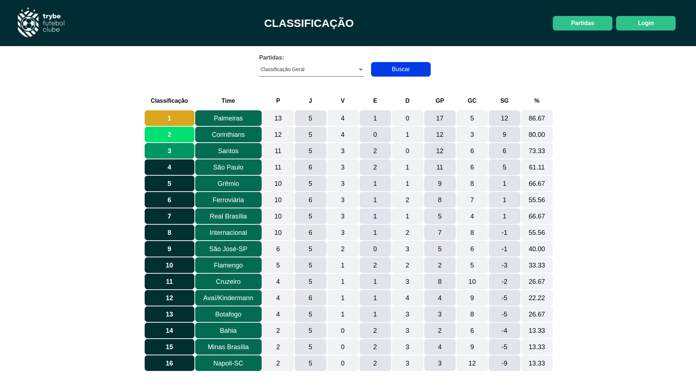
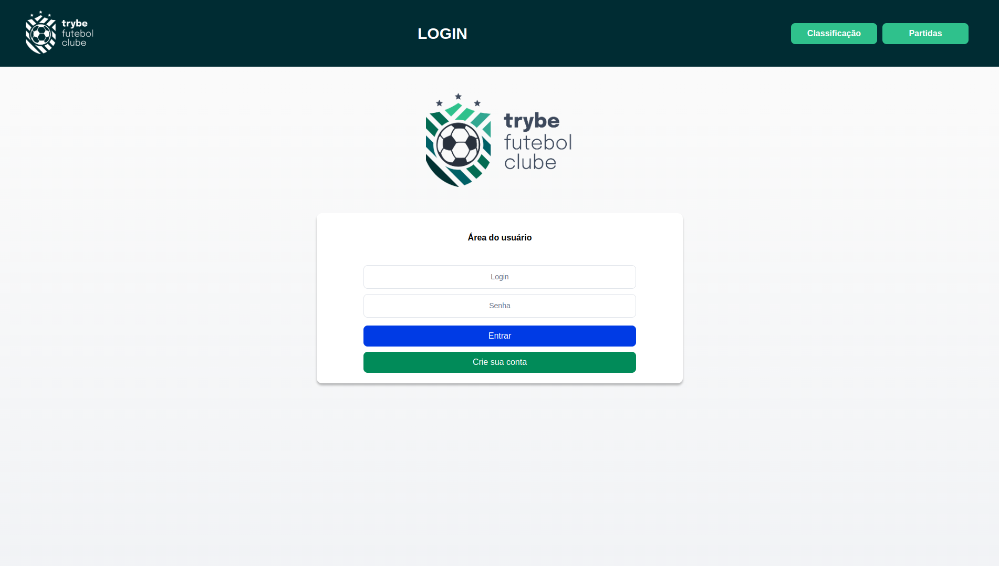
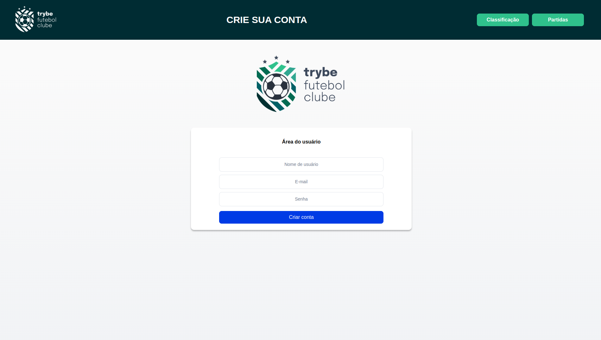
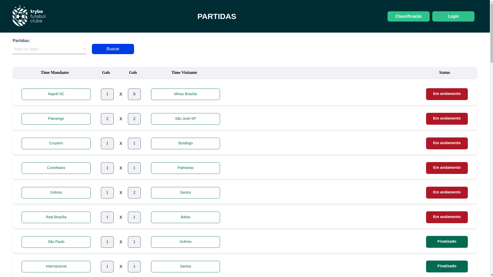
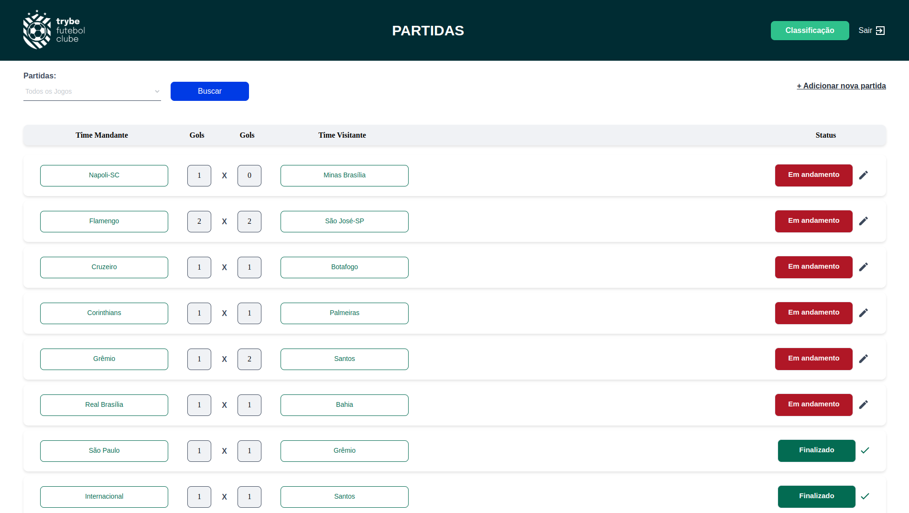
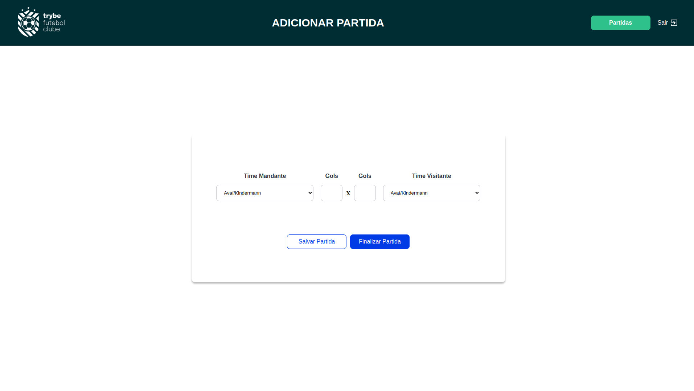
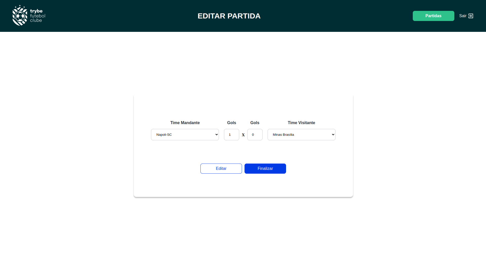

Projeto de criação de uma API para um sistema de gerenciamento de partidas de futebol, com serviços de logon, login e logout de usuários; cadastro, atualização e encerramento de partidas para usuários administradores; compilação dos dados das partidas para todos os usuários em tabela de classificação e filtragem de partidas por time mandante e/ou visitante. Para garantir a encriptação da senha dos usuários, foi utilizado o bcrypt.

___

## 🐋 Rodando o projeto com Docker
Para rodar o projeto utilizando docker, no diretório app execute o comando:

`docker-compose up -d --build`

Para acompanhar os logs do container do servidor backend, com nodemon já em execução:

`docker logs -n 90 -f app_backend`

Para acessar o frontend da aplicação, acesse o endereço:

`http://localhost:3000`

___

## ⚽ Demonstração da aplicação

<h3>Página inicial:</h3>

<h3>Página de login:</h3>

<h3>Página de cadastro de usuário:</h3>

<h3>Página de relação das partidas para usuário comum:</h3>

<h3>Página de relação das partidas para usuário administrador:</h3>

<h3>Página de cadastro de partidas para usuário administrador:</h3>

<h3>Página de atualização de partidas para usuário administrador:</h3>

___

## 🧑‍💻 Habilidades Utilizadas

  * Criar uma API usando `Express`;

  * Aplicar conceitos de arquitetura baseada em camadas;

  * Criar endpoints para realizar operações _CRUD_;

  * Criar um banco de dados relacional usando o `MySQL` e `Sequelize`;

  * Testes de integração;

  * Aplicar dos conceitos de POO (Programação Orientada a Objetos) em TypeScript;

  * Aplicar conceitos de TDD (Test Driven Development);

  * Aplicar conceitos de SOLID.

  * Dockerização da aplicação.

___
## 🧑‍🔬 Testes

A aplicação possui *testes de integração*. Para tanto, foram utilizados os frameworks `Mocha`, `Chai`, `Sinon` e `Chai-http`.
Para executar os testes, no diretório `backend` você poderá executar os seguintes comandos:

`npm test`

___
## 💻 Tecnologias usadas

  * NodeJS

  * Express

  * Nodemon

  * TypeScript

  * MYSQL

  * Sequelize

  * Docker

  * bcrypt

  * Mocha

  * Chai

  * Sinon

___

### ⭐️

Se este repositório te ajudou de alguma forma, deixe uma ⭐️!